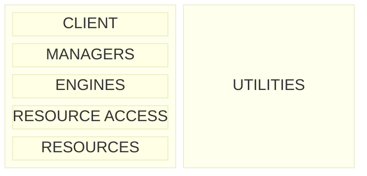
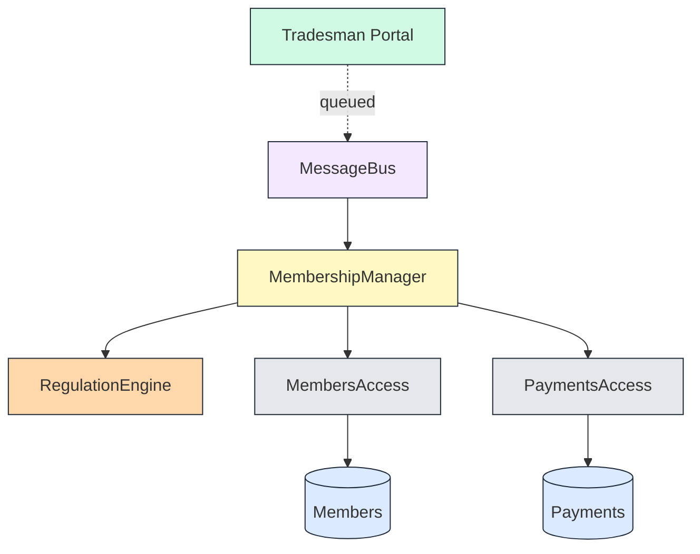

# Righting Software: System Decomposition

A collaborative iDesign decomposition session faithful to Juval Löwy's
*Righting Software*. The skill conducts a turn-by-turn interview that
establishes business framing, identifies core use cases, interrogatively
surfaces volatility, maps it to the iDesign service hierarchy
(Manager → Engine → ResourceAccess → Resource + Utilities), and validates
the result by composing call chains for each core use case.

The deeper goal — beyond producing a clean architecture — is to **help the
user surface unknown-unknowns** about their own system. The volatility
discovery techniques here (solutions-masquerading-as-requirements,
design-for-your-competitors, volatility-and-longevity, the anti-design
effort) are themselves tools for finding what the user didn't know to ask.
Use them actively; don't wait for the user to volunteer the right
information.

## When to run this skill (opt-in only)

This is a **heavyweight, multi-hour workflow**. It is not the default
on-ramp for architecture conversations. Most "where should this live?"
or "should I split this service?" questions deserve a normal
conversation, not this entire process.

**Run this skill only when the user has explicitly invited it.** That
means one of:

- The user named the skill (`righting-software-system-design`) or
  asked for it by reference
- The user referenced the source material (*Righting Software*, Juval
  Löwy, iDesign, "The Method", volatility-based decomposition) AND
  asked to go through it
- The user accepted a prior suggestion from the agent to run this
  workflow

**It is appropriate to *suggest* this skill** when the user's question
is genuinely heavy enough to warrant it — a clean-slate new system, a
monolith-to-services extraction, or recurring "every change touches
everything" pain that has resisted lighter analysis. Frame the
suggestion clearly: *"There's a guided volatility-based decomposition
workflow (a few hours of back-and-forth, produces a written report).
Want to run it, or would you rather just talk through this informally?"*

If the user declines or wants something lighter, **don't run this
skill**. Have the normal conversation instead. This workflow earns its
weight on the right problems and drowns lighter ones.

Once the user opts in, proceed to *Starting a session* below.

## Dependencies

The skill has one optional-but-recommended external dependency:

- **[D2](https://d2lang.com)** (CLI, free single binary) — used in
  Phase 5 to render the final architecture and call-chain diagrams.
  Without it, the skill falls back to embedded hand-written SVG, which
  produces the same visual output but with more verbose source.
  Install via `winget install terrastruct.d2` (Windows),
  `brew install d2` (macOS), or download from <https://d2lang.com>.

Phases 0–4 use only Mermaid (renders in any markdown viewer), so D2 is
not required to start a session — only to produce the final report's
polished diagrams. The skill will check D2 availability when it reaches
Phase 5 and tell the user once if it's missing, then continue with the
SVG fallback.

## The first principles (non-negotiable)

These four rules govern every decision in the session. Refer back to them
constantly.

1. **Decompose by volatility, not functionality.** Every component must
   answer: *what single axis of change does this encapsulate?* If the
   answer is a verb or use-case step (Validate, Price, Ship, Notify), the
   boundary is functional and wrong. If the answer is a crisp axis of
   change (tax law, partner API, pricing rule, regulator), the boundary
   is correct.

2. **There is no feature.** Features are always and everywhere aspects
   of *integration*, not implementation. The system supports a use case
   by integrating components — never by housing the use case in a
   component named after it. If the user asks "where does feature X
   live?", the correct answer is always a call chain across components,
   never a single component.

3. **Never design against the requirements.** Requirements change.
   Design against the smallest set of components that supports all
   *core* use cases through different compositions. When requirements
   change, the composition (Manager workflow code) changes — not the
   decomposition.

4. **Strive for the smallest set.** The architect's mission is the
   smallest set of components that can compose to support every core use
   case. Typical well-designed systems land at ~10–20 components total
   (2–5 Managers, 2–3 Engines, 3–8 ResourceAccess + Resources, ~6
   Utilities). A 1-component design is unvalidatable; a 100-component
   design is functional decomposition.

## How to run this interview

This skill is not a generator — it is a Socratic interview. The shape of
each turn:

- **Ask, then deepen.** When the user answers, follow up. "What changes
  when that changes?" "Why is that volatile?" "Has it actually changed,
  or could it?" Surface assumptions, contradictions, and what's missing.
- **Reflect and paraphrase.** Restate what you heard before moving on.
  This catches misinterpretation early and signals you're listening.
- **Propose, don't only ask.** Use your domain knowledge to suggest
  candidate volatilities the user didn't mention. *"Most marketplaces of
  this shape eventually see X — does that apply here?"* This is the
  primary unknown-unknowns surfacing move.
- **Challenge candidates.** Every proposed volatility must answer: what
  exactly is volatile, why is it volatile, what's the likelihood and
  effect of change, and could it be a sub-attribute of something else?
  Reject candidates that are merely variable or speculative.
- **Ask with a structured choice at branches.** When the user faces a
  discrete choice (new vs. refactor, encapsulate vs. fold-in, which Manager
  owns X), present 2–4 options with brief reasoning rather than open prose
  (Claude Code: `AskUserQuestion`; otherwise a numbered list).
- **Stop and check in between phases.** Never proceed to the next phase
  without an explicit "looks good, continue" from the user.

The user is the domain expert; you are the methodology expert. The job
is to apply Löwy's rules to their context, not to teach iDesign as a
lecture.

## Starting a session

Before anything else, suggest a short kebab-case name for the system
being decomposed. *"I'm trying to figure out how to structure our order
pipeline"* → suggest `order-pipeline`. Let the user override.

Then ask, as a structured choice:

> **Is this a new system or a refactor of an existing one?**
>
> - New system — greenfield, no legacy
> - Refactor — existing system being restructured

The methodology is identical either way, but the final report differs
(greenfield gets a build sequence; refactor gets a current-→-target
mapping with extraction priorities).

All persistent artifacts live in `decompositions/{system-name}/`:

| File                                          | Purpose                                            |
|-----------------------------------------------|----------------------------------------------------|
| `decompositions/{system-name}/report.md`      | The growing recommendation report — the headline artifact |
| `decompositions/{system-name}/use-cases.md`   | (Optional) raw use cases with swim lanes, if they grow long |

Write everything important to `report.md` as the session progresses.
Chat is the conversation surface; the file is the durable record.

If a decomposition was previously run on this system, pick
a distinct system name (`order-pipeline-v2`, `order-pipeline-rework`,
etc.) so the prior report isn't overwritten. The directory layout is
intentional: each session gets its own `decompositions/{system-name}/`
subtree.

---

## Phase 0: Framing — Vision, Objectives, Mission

**Goal**: Establish the business framing that *compels* volatility-based
decomposition. This phase exists because Löwy's hardest political problem
is getting management to accept the methodology — and the trick is to
have the business itself instruct the architect to design correctly.

Without this framing, the rest of the session produces a defensible
design that the org will still reject. With it, the design is the
business's logical conclusion.

### Step 0a: The Vision

Ask: **"In one sentence, what is this system?"**

Push for terseness. *"Read it like a legal statement."* A good vision is
one sentence, business-perspective, no implementation language.

**Examples from the book:**
- TradeMe: *"A platform for building applications to support the TradeMe marketplace."*

If the user gives a paragraph, distill it together. If the user gives a
feature list, push back — features are not vision.

### Step 0b: The Business Objectives

Ask: **"What does the business need from this system? Itemize."**

Rules:
- Business perspective only. Reject technology objectives ("use Kubernetes"),
  marketing objectives ("look better than competitor X"), and specific
  requirements ("send an email when …").
- Each objective must serve the vision. Reject anything that doesn't.
- Aim for 3–8 objectives.

If the user lists fewer than three, probe: *"What about scalability?
Localization? Compliance? Speed of feature delivery? Audit
trails? Recovery from incidents?"* — propose candidates from common
business concerns.

### Step 0c: The Mission Statement

This is the most important sentence in the whole session.

Draft: **"Design and build a collection of software components that the
development team can assemble into applications and features."**

Adjust the wording to the user's context, but preserve the structure:
the mission is to build **components** that **compose** into features —
NOT to build the features themselves. This is the rhetorical move that
makes volatility-based decomposition the business's idea.

### Step 0d: Write the framing

Add a `## Framing` section to `report.md` with the vision, the
objectives (as a numbered list), and the mission statement. End the
section with the chain:

> Vision → Objectives → Mission Statement → Architecture

**Stop and check in**:

> "Here's the framing. Does the mission statement actually capture how
> you want the team to think about this system? Anything missing from
> the objectives? Once you're happy, we'll move to use cases."

Wait for the user.

---

## Phase 1: Use Cases & Glossary

**Goal**: Capture the required *behaviors* (not functionalities) of the
system, identify the small number of **core use cases**, and build a
shared glossary. This phase is where the user's mental model becomes
visible.

### Step 1a: Gather raw use cases

Ask: **"Walk me through how the system will be used. Don't worry about
order or completeness yet — just what needs to happen."**

Capture each as a short list with: trigger, primary actor, sequence,
outcome, error paths. Use plain text — diagrams come later if needed.

**Surface unknown-unknowns aggressively here.** Löwy's quote: *"the
users interact with or observe just a small part of the system, which
represents the tip of the iceberg. The bulk of the system remains below
the waterline."* Probe for:
- **Background processes** — schedulers, timers, batch jobs, reconciliations
- **Admin / operator use cases** — system administrators, support staff
- **External-system-triggered use cases** — webhooks, partner callbacks
- **Error and recovery paths** — refunds, reversals, retries, manual intervention
- **Reporting and audit** — compliance, business intelligence, monitoring
- **Long-running flows** — anything that spans multiple sessions / devices / days

Propose candidates from your knowledge of similar systems. *"In most
marketplace systems I've seen, there's also a dispute resolution flow.
Does that apply here?"*

### Step 1b: Swim lanes

For any use case involving multiple roles or subsystems, redraw it as an
activity diagram with **swim lanes** — one lane per role/entity (Client,
Member, Market, Regulator, etc.). This isn't decoration; the swim lanes
themselves become candidate subsystem boundaries in Phase 3.

If the lanes are obvious from text, you can describe them; if not,
sketch a Mermaid `flowchart` or just a structured outline.

### Step 1c: The glossary (Four Questions)

Build a glossary by answering the **Four Questions**:

| Question | What it captures |
|----------|------------------|
| **Who** | Actors — users, external systems, schedulers |
| **What** | Top-level required behaviors / capabilities |
| **How** | Activities the system performs (the verbs) |
| **Where** | Data and external dependencies — where state lives |

These map roughly to architectural layers later (Who→Clients,
What→Managers, How→Engines + ResourceAccess, Where→Resources). The
**What** list especially hints at subsystem boundaries.

### Step 1d: Identify the core use cases

This is the most consequential step in Phase 1.

> "Most systems have 2–6 core use cases. The rest are variations.
> Looking at what we've collected, which use cases capture the *essence
> of the business*? If this system did nothing else, which would still
> need to work?"

The core use cases:
- Are usually **abstractions** of the listed use cases — may need a new name
- Are rarely explicit in any requirements doc
- Tend to be 2–6; if the user names more than 6, push back: are these
  really distinct, or variations?
- Hint: count the bullets on a one-page marketing brochure for the system

**Example from TradeMe**: of ~8 listed use cases (Add Tradesman, Request
Tradesman, Match, Assign, Terminate, Pay, Create Project, Close
Project), only **Match Tradesman** is a core use case. The rest are
plumbing.

### Step 1e: Write Phase 1

Add to `report.md`:
- `## Glossary` (Four Questions)
- `## Use Cases` — list with brief sequences
- `## Core Use Cases` — the 2–6, with a short paragraph each explaining
  why this captures the essence

If use cases grow long, split them into `use-cases.md` and link.

**Stop and check in**:

> "I've documented use cases and called out what I think are the core
> ones. Read through and tell me: are the core use cases actually core?
> Anything I've missed below the waterline? Once we agree on the cores,
> we'll dig into volatility."

Wait for the user.

---

## Phase 2: Volatility Analysis

**Goal**: Identify what's actually volatile (and what isn't), through
challenge and discovery rather than passive elicitation. This is the
phase where unknown-unknowns are most likely to surface.

This phase produces a **Volatilities List** — candidate areas of change
with rationale. It does not yet name components.

### Step 2a: The two axes of volatility

Löwy defines exactly **two axes**:

1. **Same customer over time** — even if the system perfectly fits one
   customer today, that customer's context will change.
2. **Different customers at the same point in time** — across the
   customer base today, who uses the system differently?

The axes should be **independent**. If a candidate volatility can't be
cleanly assigned to one axis or the other, that's a signal of
functional decomposition in disguise — investigate further.

> Note: you may have seen "five axes" frameworks (requirements /
> technology / integration / data / policy) elsewhere. That isn't from
> *Righting Software* — Löwy's book defines only the two axes above.
> The five categories can be useful prompts during Step 2c (axes
> sweep), but they aren't the framework.

### Step 2b: Volatile vs. Variable

Before listing any volatility, share this distinction with the user:

> **Variable**: something that changes but is handled in code with
> conditional logic. Adding a new attribute to a customer record is
> variable.
>
> **Volatile**: something open-ended whose changes ripple across the
> system unless encapsulated. Swapping payment providers is volatile.

**Only encapsulate volatility, not variability.** Most candidates the
user volunteers will be variability. Filter ruthlessly.

### Step 2c: Surface candidates through multiple lenses

Don't just ask "what changes?" — that gets opinions. Use these lenses
to *discover* volatility the user hadn't named:

1. **Change history**: *"In the last 1–2 years, what changed in this
   system or its predecessor, and why? Group changes by reason."*
2. **Roadmap**: *"What's planned for the next 6–12 months? What's been
   discussed but not committed?"*
3. **The longevity heuristic** (powerful for surfacing missed
   volatilities): *"How long do you expect this system to be in
   service? Now look back the same number of years — what changed in
   that window? Whatever changed before will likely change again."*
4. **Design for your competitors**: *"Could your direct competitor use
   this system as-is? Where would they need it to behave differently?"*
   Differences expose volatility; sameness exposes nature-of-business.
5. **Solutions masquerading as requirements** (see Step 2d).
6. **Anti-design contrast**: walk through a deliberately-bad
   functional or domain decomposition; the points of pain it exposes
   are often volatility you'd otherwise miss.
7. **The agent proposes**: based on the domain (payments, marketplace,
   logistics, SaaS, etc.), suggest 3–5 common volatilities for that
   class of system the user hasn't mentioned. Present the candidates as
   a structured choice if helpful.

### Step 2d: Peel solutions-masquerading-as-requirements

This is Löwy's primary volatility-discovery technique. Many "requirements"
the user states are actually solutions to a deeper need. Peel them
recursively:

> *"Send an email confirmation."* → real requirement is **notify**
> (could be email, SMS, push). Volatility: notification transport.
>
> *"Cooking in the kitchen."* → real requirement is **feed the
> occupants**. → real-real requirement is **occupants' well-being**.

For each candidate volatility, ask:
1. Is this a solution or a real requirement?
2. What other solutions could satisfy the same need?
3. What's the *underlying* volatility?

### Step 2e: Filter — what NOT to encapsulate

Volatility-based decomposition can be over-applied. Reject candidates
that fail any of these tests:

- **Nature of the business**: does it relate to what the company
  fundamentally does? Two indicators: (a) change is rare,
  (b) any attempt to encapsulate it would be done poorly given
  available resources. *Don't encapsulate the nature of the business.*
  (FedEx → Healthcare branch ≠ a volatility to encapsulate.)
- **Speculative**: is the change extremely unlikely AND would the
  encapsulation only be done poorly? Reject (the SCUBA-ready high
  heels test).
- **Merely variable**: handled by conditionals; no ripple effect.
- **Out of scope**: the volatility is real, but it's owned by an
  external Resource (e.g., an external payment system's internal
  volatility).

When rejecting a candidate, **state the rejection reason explicitly** in
the report. The user should be able to defend each rejection later.

### Step 2f: Cluster and challenge

For each surviving candidate, document:
- A name (just descriptive, not a component name yet)
- What changes
- Why (the underlying driver)
- Which axis (or both)
- Ripple radius — "if this changes, what else has to change with it?"

Activities that change for the *same reason* belong together;
activities that change for *different reasons* belong apart, even if
they look related.

This list is the input to Phase 3, which is where components get
named. A single component will often own several entries from this
list when they ripple together (e.g., a Manager owning the workflow
volatility of a whole use-case family), though a component owning one
standalone axis is also valid. Cluster axes here when they share a
reason for change — that's exactly what this step is for — but don't
assign component boundaries yet. Leave each clustered axis named so
the report's audit trail from volatilities to components stays
intact, and let Phase 3 decide which clusters become which
components.

### Step 2g: Write Phase 2

Add a `## Volatility Analysis` section to `report.md`:
- Short paragraph per major volatility, with the why
- Table of candidate volatility clusters
- An **explicit list of rejected candidates** with rejection reasons

```markdown
### Rejected as not architecturally volatile

| Candidate          | Reason                                                          |
|--------------------|-----------------------------------------------------------------|
| Adding new fields to a tradesman record | Variable, not volatile — handled by schema migration |
| Branching into healthcare staffing      | Nature of the business — would redefine the company |
| Optimization algorithms for project matching | Speculative — company isn't in the optimization business |
```

**Stop and check in**:

> "Here's the volatility analysis with the candidates I've accepted and
> rejected. The rejections are as important as the accepts — challenge
> any of them you disagree with. Anything I've split that should be
> merged, merged that should be split, or missed entirely?"

Wait for the user. Expect to iterate here.

For deeper coverage of volatility-discovery techniques, see
`references/volatility-techniques.md`.

---

## Phase 3: Component Definition

**Goal**: Map the validated volatility list to the iDesign service
hierarchy, using the Four Questions as a check.

### Volatility-to-component mapping isn't 1:1

A component can encapsulate one volatility or several. Both are valid;
the choice depends on whether the volatilities genuinely ripple
together. *Righting Software* is explicit that many-to-one is common —
the TradeMe `MarketManager` owns three volatilities (managing projects,
matching tradesmen to projects, charging fees for the match) because
they're a family of logically related use cases sharing one
workflow-sequence axis. The same book also shows single-volatility
Managers: TradeMe's `EducationManager` encapsulates only the education
workflow, with searching and regulatory compliance pushed to other
components.

There's a **directional bias toward consolidation**, driven by the
smallest-set principle (first principles #4). The book frames this as
minimizing the amount of work in detailed design and implementation:
1 component is too few (a monolith hides complexity inside) and 300
components is too many (integration cost explodes). The right answer
lives around an order of magnitude of 10. The bias has a hard limit:
**cohesion**. Volatilities that change for related reasons belong
together; volatilities that change for unrelated reasons stay apart
even when merging them would lower the count. Cramming unrelated axes
into one component isn't consolidation — it's functional decomposition
with a smaller N.

Common shapes (per *Righting Software*, Ch. 3 and Ch. 5):

- A **Manager** often owns the sequence volatility of a *family* of
  related use cases — frequently 2–4 listed volatilities sharing the
  same workflow-orchestration axis. A Manager owning one volatility is
  also valid when no other workflow family is related enough to share
  orchestration with it (e.g., TradeMe's `EducationManager`).
- An **Engine** has more restricted scope than a Manager, encapsulating
  business rules and activities. Single-axis Engines are normal; the
  book's `RegulationEngine` and `SearchEngine` are each one activity
  volatility.
- A **ResourceAccess** typically owns *both* the volatility of how the
  Resource is accessed AND volatility of the Resource itself —
  *"Resource changes invariably change ResourceAccess as well"* (Löwy).
  Splitting these into separate components is a common
  over-decomposition mistake.

If your Phase 2 list has 15 volatilities and your Phase 3 proposal has
15 components, the design probably hasn't done any consolidation work —
look for related axes that could share a component. But don't force
merges; an N-to-N mapping that genuinely reflects N unrelated axes is
better than a low count built on weak cohesion.

### The hierarchy

| Type             | Encapsulates                                              | Calls       |
|------------------|-----------------------------------------------------------|-------------|
| **Clients**      | Volatility in entry points (UIs, APIs, schedulers)        | Managers    |
| **Managers**     | Volatility in the *sequence* / workflow of use cases      | Engines, ResourceAccess, Utilities |
| **Engines**      | Volatility in *activities* — business rules, calculations | ResourceAccess, Utilities |
| **ResourceAccess** | Volatility in *how* a Resource is accessed AND in the Resource itself | Resources, Utilities |
| **Resources**    | The actual data/external systems (DB, cache, external APIs) | —         |
| **Utilities**    | Cross-cutting infrastructure (Logging, Security, Pub/Sub) | (anyone, via the utility bar) |

### The Four Questions check

Map each volatility to a question, and the question to a layer:

| Question | Layer |
|----------|-------|
| **Who** interacts with the system? | Clients |
| **What** is required of the system? | Managers |
| **How** does the system perform business activities? | Engines |
| **How** does the system access resources? | ResourceAccess |
| **Where** does the system's state live? | Resources |

If a candidate component doesn't crisply answer one question, you've
either picked the wrong layer or missed a volatility.

### Closed architecture rules

Calls go top-down only. Allowed:
- Client → Manager
- Manager → Engine
- Manager → ResourceAccess (Engines are optional; Managers can call Access directly when there's no activity volatility to encapsulate)
- Engine → ResourceAccess
- Any layer → Utilities (the vertical bar)
- ResourceAccess → Resources

Forbidden:
- Sideways calls (Manager → Manager, Engine → Engine, ResourceAccess → ResourceAccess)
- Calling up (Engine → Manager, Manager → Client)
- Skip-level down (Manager → Resource, Client → Engine)
- Clients calling multiple Managers in a single use case (sign of functional decomp)

Allowed relaxations:
- **Queued Manager → Manager** via a Pub/Sub or Message Bus utility (technically a downward call through Access; semantically a deferred second use case)
- **Manager → Pub/Sub utility → other Managers** for fan-out (instead of sideways calls)

See `references/anti-patterns.md` for the full design-don'ts catalog.

### Naming conventions

Two-part Pascal-case compound words. **Suffix = service type**:

| Type             | Suffix         | Prefix                                              | Examples                                |
|------------------|----------------|-----------------------------------------------------|-----------------------------------------|
| Manager          | `Manager`      | Noun — the volatility encapsulated in the use cases | `MembershipManager`, `MarketManager`    |
| Engine           | `Engine`       | Noun OR gerund — the encapsulated activity          | `SearchEngine`, `RegulationEngine`, `CalculatingEngine` |
| ResourceAccess   | `Access`       | Noun — the Resource / data                          | `MembersAccess`, `PaymentsAccess`, `WorkflowsAccess` |
| Utility          | (varies)       | The cross-cutting concern                           | `Logger`, `Security`, `MessageBus`      |

**Critical naming rules:**
- The ResourceAccess suffix is `Access`, not `Accessor`. (Common
  community mistake.)
- **Gerunds belong only in Engines.** A gerund anywhere else
  (`BillingManager`, `BillingAccess`) signals functional decomposition.
- **Atomic business verbs never appear in prefixes.** Verbs like
  `Credit`, `Debit`, `Pay` are operation names *on contracts*, not
  service prefixes.
- Avoid functional names: `OrderProcessor`, `PaymentHandler`,
  `NotificationSender` are use-case names. Rename to the volatility
  axis.

### Forbidden vocabulary at this stage

Infrastructure names don't belong in component names: Lambda, ECS, SQS,
DynamoDB, S3, Kubernetes, Docker, Postgres, Redis. These are deployment
concerns. A `LambdaInvoker` is decomposed by infrastructure, not
volatility. Push back and propose a volatility-axis name.

### Heuristics for getting the count right

- **Manager : Engine ratio** — roughly 2:1. 1 Manager → 0–1 Engines.
  2 Managers → ~1 Engine. 3 Managers → ~2 Engines. 5 Managers → ~3
  Engines. **8+ Managers = failed design** (you've done functional
  decomp).
- **Per subsystem** — at most 3 Managers. Subsystems are vertical
  slices (one Manager + its Engines + its ResourceAccess). Most
  systems have only a handful of subsystems.
- **Total components** — usually 10–20 in a well-designed system.
- **Engines are uncommon.** For an Engine to exist there must be real
  activity volatility — an unknown number of ways of doing something.
  Lots of Engines almost always means functional decomp at the Engine
  layer.

### Utilities litmus test

A component qualifies as a Utility only if it could plausibly serve any
other system, even one as different as a *smart cappuccino machine*.
- ✅ Logger, Security, Pub/Sub, Diagnostics — yes
- ❌ MortgageInterestCalculator — no, it's domain logic in disguise

### Almost-expendable Managers

For each Manager, apply the test: **how would you respond to a request
to change this Manager?**

- *Fight it / fear the cost* → "expensive" Manager — too big, almost
  certainly functional decomp inside
- *Shrug it off, easy change* → "expendable" Manager — pass-through, no
  real volatility encapsulated, design flaw
- *Thoughtfully estimate how to adapt the workflow* → **"almost
  expendable"** — correct. The Manager orchestrates Engines and Access,
  encapsulating only sequence volatility, and absorbs change in its
  workflow code without architectural impact.

Aim for almost-expendable Managers. Flag any that fail.

### Write the components

Add a `## Components` section to `report.md`. Lead with a Mermaid
layered diagram, then one table per tier.

#### Diagram template

Client → Manager → Engine → ResourceAccess → Resource stacked
top-to-bottom, Utilities as a vertical bar on the right consumed from
any layer. Arrows at the layer level only; the per-component
relationships are implied by layer membership.



**No arrows on the static diagram.** Layer membership already conveys
the call direction (Managers above Engines means Managers call into
Engines). Per-component arrows would clutter without adding
information. Save arrows for the call-chain diagrams in Phase 4, where
they show the specific path of one use case.

**Layer colors are consistent across every diagram in the session**
(Mermaid here, D2 and SVG in Phase 5): green for Client, yellow for
Managers, orange for Engines, grey for Access, light blue for
Resources, lavender for Utilities. The same component always uses the
same color and stays in the same row/column position across all
diagrams — that's what makes the Phase 4 symmetry check legible.

Populate every layer with at least one block before rendering — some
`block-beta` renderers drop the layer label on empty layers.

If a single layer has more than ~7 components, the system probably
wants a subsystem split.

#### Component tables

Beneath the diagram:

List **every volatility cluster** a component owns in the `Encapsulates`
column — don't compress a multi-volatility component into a single
phrase. The audit trail back to Phase 2 only works if each accepted
volatility shows up somewhere.

```markdown
### Managers
| Component      | Encapsulates (volatility clusters)                                                    | Notes |
|----------------|---------------------------------------------------------------------------------------|-------|
| MarketManager  | Managing projects; matching tradesmen to projects; charging fees for the match | Three logically related use-case families share one orchestrator; only sequence volatility lives here |
| MembershipManager | Membership management (add/remove, benefits, discounts); dispute resolution | Two related but distinct workflow families under one orchestrator |
| EducationManager  | Education workflow                                                           | Single-volatility Manager; no other workflow family shares its orchestration axis |

### Engines
| Component        | Encapsulates                                | Depends on                |
|------------------|---------------------------------------------|---------------------------|
| RegulationEngine | Regulatory rule volatility across locales   | RegulationsAccess         |
| SearchEngine     | Match-algorithm volatility                  | MembersAccess, ProjectsAccess |

### ResourceAccess
| Component        | Encapsulates                                                                  | Atomic business verbs    |
|------------------|-------------------------------------------------------------------------------|--------------------------|
| PaymentsAccess   | Payment provider choice; payment storage backend; reconciliation protocol     | Pay, Refund, Reconcile   |

### Resources
| Component | Notes |
|-----------|-------|
| Members   | Member profiles, history |

### Utilities
| Component   | Encapsulates                  |
|-------------|-------------------------------|
| Logger      | Logging framework volatility  |
| MessageBus  | Pub/Sub transport volatility  |
| Security    | Auth/AuthZ volatility         |
```

**ResourceAccess contracts**: list the atomic business verbs each one
exposes (e.g., `Pay`, `Credit`, `Debit`, `Match`, `Reserve`). Do **not**
list CRUD/IO operations (`Insert`, `Select`, `Read`, `Write`,
`Open`) — those leak the Resource technology.

**Stop and check in**:

> "Here's the component proposal. For each Manager, do the
> almost-expendable test in your head: how do you feel about being
> asked to change it? Walk through which names feel off, which
> boundaries feel wrong, or where I've put something at the wrong
> tier."

Wait for the user.

---

## Phase 4: Validation via Call Chains

**Goal**: Prove the design is composable by producing one **call chain
diagram** per core use case, then checking for symmetry and
composability across them.

A decomposition that doesn't survive its own validation isn't
volatility-based — it's guesses with better names.

### What a call chain is

For each core use case, draw the interaction:
- Components appear in their layer positions (same layout as the static
  diagram)
- **Solid black arrows** = synchronous calls
- **Dashed gray arrows** = queued / asynchronous calls
- The call chain *superimposes* on the layered diagram — don't redraw,
  just highlight

Use Mermaid `flowchart` here. Mermaid is the **iteration format** — it
renders inline in markdown, costs nothing to regenerate as the design
shifts, and is good enough for the symmetry/composability checks in this
phase. Final-report rendering switches to D2 or SVG in Phase 5; don't
spend effort polishing diagrams here. Example:



Add a brief narrative under each diagram: which Manager owns the
workflow, what triggers it, what completes it.

### Step 4a: Draw one chain per core use case

Produce a call chain for **every core use case** identified in Phase 1.
Don't validate non-core use cases here — those are variations, and the
core chains should compose to cover them.

### Step 4b: Symmetry check

Lay the chains side by side and look for **structural similarity**.
- Do all chains follow the same shape (Client → Bus → Manager → Engine → Access → Resource)?
- Does every workflow end with a Pub/Sub publish, OR none of them do?
- Are queued vs. synchronous call patterns consistent across use cases?

**Asymmetry is a design smell.** If three core use cases publish an
event at the end and the fourth doesn't, ask: why is the fourth
different? What's missing or extra?

Löwy's words: *"Symmetry is so fundamental for good design that you
should generally see the same call patterns across Managers."*

### Step 4c: Composability proof

Generate a **new hypothetical use case** — something the user didn't
mention but could plausibly want — and demonstrate that the existing
components compose to support it without architectural change.

> *"What if you needed to add 'analyze projects from 2022–2024 for
> profitability'? Walk me through the call chain using only the
> components we already have."*

If this fails — if the new use case requires a new Manager or a layer
violation — the decomposition isn't composable enough, and you should
return to Phase 2.

### Step 4d: Ripple-radius check

For 3–5 plausible future changes (drawn from the roadmap, change
history, and competitor framing in Phase 2), document which components
each change would touch.

- **Good**: each scenario touches 1–2 components
- **Bad**: any scenario touches 3+ components → unencapsulated
  volatility; revisit Phase 2

When a scenario fails, don't paper over it. Tell the user:

> "This scenario blows past three components. That means we have an
> axis of change that isn't encapsulated yet. Let me re-examine the
> clusters."

Then loop back to Phase 2.

### Write Phase 4

Add a `## Validation` section to `report.md` containing:
- One subsection per core use case, with the Mermaid call chain and a
  short narrative
- A "Symmetry observations" subsection
- A "Composability check" subsection with the hypothetical
- A "Ripple-radius scenarios" subsection (each scenario + components touched + ✅/❌)

**Stop and check in** once chains and scenarios all pass:

> "All call chains hold and the ripple-radius scenarios stay contained.
> Ready to write the final recommendation, or do you want to add more
> stress-test scenarios first?"

---

## Phase 5: Recommendation Report

**Goal**: Finalize `report.md` as a usable, handoff-ready artifact.

The framing, glossary, use cases, volatility analysis, components, and
validation are already in the file from Phases 0–4. This phase adds:

### Implementation sequence (new systems)

For greenfield, give a bottom-up build order:

1. **Utilities first** — foundations, depend on nothing
2. **Resources** — provisioned alongside Utilities
3. **ResourceAccess** — depends only on Utilities and Resources
4. **Engines** — depends on Access + Utilities
5. **Managers** — orchestrate everything

Call out which components need senior attention — typically the most
volatile ones, whose interfaces are the contract that must absorb
future change.

### Migration plan (refactors)

For existing systems, add a `## Current → Target` mapping:

- For each target component, identify where the logic currently lives
- Flag extraction priorities (which boundary hurts most today?)
- Note coupling that must break first (shared databases, peer calls,
  skip-level calls)
- Recommend an extraction order that minimizes intermediate breakage
- If the existing system has infrastructure-named components
  (`LambdaInvoker`, `SQSQueueProcessor`, `RedisCache`), propose
  volatility-axis renames as part of the mapping

### Optional: Operational concepts

If the system warrants advanced run-time patterns (Message Bus,
Workflow Managers, Message-Is-The-Application), add an `## Operational
Concepts` section. **These are optional and require organizational
maturity** — see `references/operational-concepts.md` for guidance on
when to recommend them and when to leave them out.

Default position: do **not** recommend these unless the user's
objectives in Phase 0 specifically demand them (e.g., "quick turnaround
for new features", "support deep customization across markets",
"forward-looking integration"). Otherwise, leave the run-time
interactions as direct synchronous calls and let the team mature into
the more elaborate patterns later.

### Render polished diagrams

Before finalizing the report, regenerate the static architecture and
each call chain in a higher-fidelity format. Mermaid is fine during
iteration but doesn't preserve component positions across diagrams,
which makes the Phase 4 symmetry check hard to read visually.

**Step A: Check `d2` availability**

```bash
d2 --version
```

If the command succeeds, proceed to Step B. If it fails with
"command not found", continue to Step C.

If you're on Windows and the user told you they just installed D2 but
the command isn't found, suggest restarting the shell to pick up the
new PATH before falling back.

**Step B: Generate D2 source and render**

Write D2 source under `decompositions/{system-name}/diagrams/`:
- One `static.d2` for the layered architecture
- One `callchain-{usecase-slug}.d2` per core use case (use the same
  filename slug for every diagram referencing the use case)

Use the canonical templates in `references/diagram-templates.md`. The
templates enforce a **stable component coordinate map** — the same
component always sits in the same row/column across every diagram,
which is what makes Phase 4's symmetry check easy to verify by eye.

Render each:

```bash
d2 diagrams/static.d2 diagrams/static.svg
d2 diagrams/callchain-match-tradesman.d2 diagrams/callchain-match-tradesman.svg
```

Then reference the rendered SVGs from `report.md` with relative paths:

```markdown


```

**Step C: `d2` not installed — pause or fall back**

D2 is the preferred final format because it's **codified source that
can be modified after the fact**. The SVG fallback produces the same
visual output but is awkward to edit later (hand-tweaking SVG paths
vs. editing readable D2 source).

Offer two paths as a structured choice:

> `d2` isn't on PATH, so the final diagrams can't be emitted in their
> preferred (editable) form. Two options:
>
> 1. **Pause and install** — `winget install terrastruct.d2` (Windows)
>    or `brew install d2` (macOS), then restart the shell and tell me
>    to continue. This is the recommended path; D2 output is editable
>    going forward.
> 2. **Fall back to embedded SVG** — visually identical, but harder
>    to modify after the report is written. Pick this only if D2
>    install is genuinely not an option.

If the user picks option 1, stop and wait. When they resume, retry
Step A.

If the user picks option 2, write SVG directly to `diagrams/` using
the SVG templates in `references/diagram-templates.md` (same
coordinate map, just emitted as SVG).

**Don't mix formats in the final report.** Pick one and use it for
the static diagram and every call chain. Consistency is the point.

### Open questions and risks

Surface anything you couldn't resolve:
- Volatility axes where evidence was thin
- Components that passed validation but felt fragile
- Assumptions that should be re-tested in 6 months
- Areas where the user disagreed with the methodology — note the
  disagreement, the user's reasoning, and the implication

### Hand off

Tell the user:

> "`decompositions/{system-name}/report.md` is the recommendation
> (with raw use cases in `use-cases.md` if that file exists). It's
> structured so you can hand it to a team to either build from or
> refactor toward. Want me to draft an ADR or a kickoff doc from it,
> or are we done?"

---

## Reference: when to consult the extra material

This skill is mostly self-contained, but four reference files cover
deeper material that doesn't belong inline:

- **`references/volatility-techniques.md`** — extended techniques for
  surfacing volatility (the anti-design effort, design factoring
  iterations, design-for-your-competitors variants). Consult during
  Phase 2 if the user is stuck or the candidate list feels thin.
- **`references/operational-concepts.md`** — Message Bus,
  Message-Is-The-Application pattern, Workflow Managers. Consult in
  Phase 5 only if the Phase 0 objectives suggest advanced patterns are
  warranted.
- **`references/anti-patterns.md`** — full catalog of design "don'ts"
  from the book (event publishing rules, queue rules, layer-call
  rules). Consult during Phase 3 component definition and during Phase
  4 validation as a checklist.
- **`references/diagram-templates.md`** — canonical component
  coordinate map and source templates for both D2 and SVG output.
  Consult in Phase 5 when rendering the final diagrams.

---

## Things not to do

- **Don't lecture.** The user knows their domain; you know the
  methodology. Apply the rules to their context.
- **Don't skip Phase 0.** Skipping framing produces a defensible
  design that the org will reject anyway.
- **Don't analyze during Phase 1.** Use-case walkthroughs lose
  information the moment you start proposing boundaries.
- **Don't accept volatility candidates passively.** Challenge each
  one with the volatile-vs-variable, solutions-masquerading,
  nature-of-business, and longevity tests. The user proposed it doesn't
  mean it survives.
- **Don't skip validation.** Call chains are not optional decoration —
  they are the proof that the decomposition is composable.
- **Don't recommend operational concepts (Message Bus, MITA, Workflow
  Managers) by default.** They require organizational maturity. Match
  the recommendation to the Phase 0 objectives and the team's stated
  capabilities.
- **Don't let infrastructure names into component names.** Save those
  for the deployment plan.
- **Don't treat this skill as a one-shot generator.** The value is in
  the back-and-forth — the user's reactions in Phases 2–4 are where the
  decomposition actually gets right.
- **Don't widen scope into deployment, technology choices, or org
  structure.** Those come *after* the decomposition exists.
- **Don't blend rejected and accepted volatility silently.** Reject
  candidates explicitly with a stated reason in the report.
- **Don't accept the user's first answer as final.** Use the
  unknown-unknowns surfacing techniques (competitor framing, longevity
  heuristic, candidate proposals from your domain knowledge) to push
  past what the user already knew to say.
